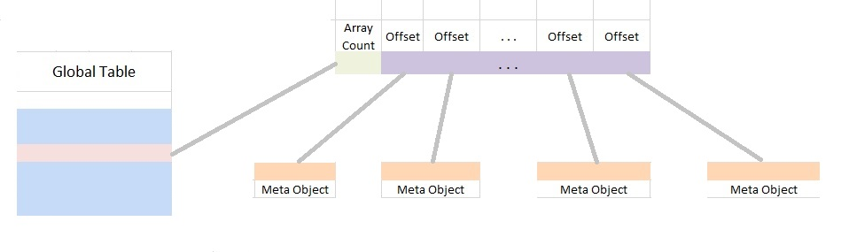
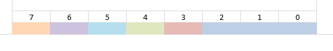
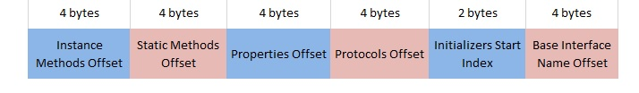
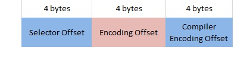

# General

1. Metadata is stored in a binary file, which consists of two main parts - a global table (GT) and a heap.
2. For numbers a little endian format is used.
3. An offset of a structure in the file is an unsigned 4 byte number (always positive) equal to the number of bytes between the beginning of the heap section and the first byte of the structure(so every offset in the file is pointing to a place in the heap).
4. A sequence of identical consecutive objects with optional 4 byte array count at the beginning we will call an array.
5. A string is represented as ASCII encoded array of characters with null byte at the end.

In the binary file the global table is at the beginning of the file and the heap is located after it.

# Heap

The heap is the place where all the meaningful information is stored in arbitrary order (strings, metadata objects, arrays etc.). All strings in the heap are interned to prevent duplications.

# Global Table

The global table is an array of offsets (with count at the beginning) serving as hash table of MOs (metadata objects). Every offset in the GT points to an array of offsets (with count at the beginning) each of which is pointing to metadata object. The hash of a metadata object is equal to the hash of its JS name. To find metadata object by given JS name, the hash of the name is calculated (with the default StringHasher built in JavaScriptCore) then it is modulo divided by the size of the GT and the result is the index in the GT where the metadata object resides. The array of metadata objects at the given index in the GT should be iterated and the JS name must be compared to the JS name of each metadata object in the list to find the searched object.

# Metadata Object

A **metadata object** (MO) is a structure (minimum of 6 bytes in length) holding the information for a single symbol.

## Names offset

Every symbol **has JavaScript name** and **real name** . The JS name is the unique name of the symbol in the JS global objects. The real name is the name of the symbol in Objective-C (or C). In most of the cases the JS name is identical with the real name but there are exceptions (_NSObject_ protocol has the same name as the _NSObject_ interface. To resolve the collision the string "Protocol" is appended to the _NSObject_ protocol name, so the JS name of the _NSObject_ protocol is "NSObjectProtocol" but its real name is "NSObject". ). When the JS name and the real name of the symbol are identical the _Names offset_ is pointing to this name. Otherwise the _Names offset_ is pointing to array of 2 offsets (without count at the beginning), the first of which is pointing to the JS name and the second – to the real name. In the second scenario a flag in _Flags section_ is set to indicate that the metadata object has a real name.

## Flags section

The Flags section is holding 8 flags (not all of them are used).

Flags 0, 1 and 2 are used to encode a number (from 0 to 7) representing the type of metadata object (0 – Unknown (not used), 1 – Structure, 2 – Union, 3 – Function, 4 – Enumeration, 5 – Global variable, 6 – Interface, 7 - Protocol). The only exceptions are methods and properties. They are stored in different arrays and they are accessible only through their owner (interface or protocol), so there is no need for them to store its type. In properties and methods flags 0, 1 and 2 have different meaning (see _Metadata Objects Specific Information_ section).

Flag 3 is true if the symbol's JS name is different from its real name (see _Names offset_ section).

## Framework Id

Every framework is encoded as 8-bit number. The metadata reader decodes the framework name by searching the framework id in a map. The special value 0 is used for unknown framework.

## Metadata object specific information (Info section)

In the **Info section** resides all the metadata object specific information. The encoding of this information is different for the different types of metadata object. For example an interface metadata object will store here information about its methods, properties and protocols, but structure metadata object will store information about its fields.

# Metadata Objects Specific Information

Every metadata object has specific, custom encoded data depending on its type.

## Records (Structures and Unions)

The **Info section** contains an offset to the fields encoding (which is a string), fields count and for every field – an offset pointing to the name of the field in the same order they appear in the record declaration.

## Functions

The **Info section** contains a single offset pointing to the type encoding of the function (a string produced by the concatenation of the return type encoding and all parameters type encodings).

Functions use **flag 4** to denotes if the function is variadic (1 if variadic, otherwise - 0).

## Enumeration

The **Info section** contains a single offset pointing to a string which value is JSON serialized object which stores all field names and values of the enumeration as key value pair.

## Variables

The **Info section** contains a single offset pointing to a string which value is the type encoding of the variable.

## Interfaces

An **interface metadata object** contains information about all of its **own** members and all of the **own** members of its **own** categories. It stores the names of base interface and implemented protocols, but **do not** store information about its members.

 

The **Info section** contains

1. Offset to array (with count at the beginning) of offsets, where every offset is pointing to metadata object for a single instance method. The methods are ordered ascending by name.
2. Offset to array (with count at the beginning) of offsets, where every offset is pointing to metadata object for a single static method. The methods are ordered ascending by name.
3. Offset to array (with count at the beginning) of offsets, where every offset is pointing to metadata object for a single property. The properties are ordered ascending by name.
4. Offset to array (with count at the beginning) of offsets, where every offset is pointing to a name (string) of protocol, implanted by the interface or own category of the interface. The protocols are ordered ascending by name.
5. 16-bit integer representing the index in the instance methods array where the first initializer is found. All instance methods starting with "init" are considered to be initializers. Because the instance methods array is sorted by name, all initializers are together in the array. The value is -1 if the interface has no initializers.
6. Offset to the name of the base class of the interface (null if the interface has no base class).

If an interface has no members in some of these arrays, the pointer pointing to the array is null (0).

## Protocols

A **protocol metadata object** looks the same as an interface metadata object with the only difference that a protocol metadata object has no _base interface name offset_ because Objective-C has no the concept of base protocol.

## Members

A **member metadata object** can be **method metadata object** or **property metadata object** . They have some things in common and some specific characteristics. Properties and methods are stored in different arrays and they are accessible only through their owner (interface or protocol) and not directly accessible from GT, so there is no need for them to store its type. In properties and methods the flags have other meaning: flag 0 is true only if the current member is considered to be a **local duplicate** . When in a single interface (or protocol) there are members with the same JS name one of them is considered the original and all the other – local duplicates.

Flag 1 is true only if the current member is **hiding** other members (when the member has local duplicates, or when in the hierarchy there is other member with the same JS name).

## Methods

A **method metadata object** inherits all characteristics of **member metadata object** and adds some more specific. For methods flag 4 is true if the method is **variadic** and flag 2 – if the method is variadic and expects **null terminated** list of parameters.

  

The **Info section** contains 3 offsets – the first is pointing to a string which value is the **selector** of the method, the second is pointing to the method encoding (a string produced by the concatenation of the return type encoding and all parameters type encodings) and the third is pointing to the compiler encoding of the method.

## Properties

A **property metadata object** inherits all characteristics of **member metadata object** and adds some more specific. For properties flag 4 is true if the property has getter and flag 5 – if the property has setter. The **Info section** contains 1 or 2 offsets. When the property has getter and setter the first offset is pointing to the **getter metadata object** and the second – to the **setter metadata object** . If the property has only getter or setter, there is only one offset pointing to it.
