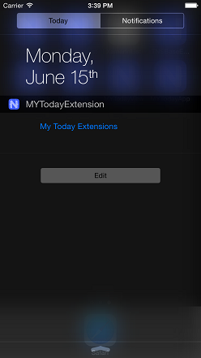

# iOS Extensions: Today Widget Extension
Lets set up a new tns application using the CLI:
``` bash
$ tns create MYTodayApp
$ cd MYTodayApp/
$ tns platform add ios
$ tns prepare ios
```

> **NOTE:** We do not have a tooling in the CLI that creates extensions so you will have to work excessively with the Xcode project in `platforms/ios`.

We will guide you through the steps to set up the following today widget:



## Adding Today Extension Target
Open the Xcode project at `platform/ios/MYTodayApp.xcodeproj` in Xcode. Select the MYTodayApp project and add new target from 'Application Extension' section - 'Today Extension'. In the dialog that will appear select 'MYTodayExtension' as product name.

### Setting up the MYTodayApp Target
Now in 'MYTodayApp' target's 'General' section, to the 'Embedded Binaries', add the `platform/ios/NativeScript.framework`. And set the 'Deployment Info', 'Deployment Target' to iOS 8.0.

From the 'Build Phases' section, remove the 'libNativeScript.a' library.

> **NOTE:** The NativeScript.framework is a shared framework that will be used both in the app and the extension.

### Setting up the MYTodayExtension Target
In the MYToday extension target, in the 'Link Binary With Libraries', add the `platform/ios/NativeScript.framework`.

From the 'MYTodayApp' target's 'Build Phases' copy 'Generate Metadata' to the 'MYTodayExtension' target's 'Build Phases'.

In the 'MYTodayExtension/Supporting Files' delete the:
 - 'TodayViewController.h'
 - 'TodayViewController.m'
 - 'MainInterface.storyboard'
 
We will implement them in pure JavaScript.

Also in the 'MYTodayExtension/Supporting Files/Info.plist', replace the NSExtensionMainStoryboard setting to MainInterface, with NSExtensionPrincipalClass setting to TodayViewController.

In 'MYToday/Supporting Files' add `main.m` Objective-C file, with the following bootstrapping code:
``` Objective-C
#import <NativeScript/NativeScript.h>

static TNSRuntime* runtime;

__attribute__((constructor))
void initialize() {
    runtime = [[TNSRuntime alloc] initWithApplicationPath:[NSBundle mainBundle].bundlePath];
    TNSRuntimeInspector.logsToSystemConsole = YES;
    [runtime executeModule:@"./my-today-extension"];
}
```

Last but not least, select 'MYTodayApp/app' and from the right hand pane file inspector, from the 'Target Membership' section check also the 'MYTodayExtension'.

This will copy the JavaScript files from the main bundle ('MYTodayApp') to the extension bundle ('MYTodayExtension'). You now have to write some JavaScript to lift of the proper controllers.

## Adding the JavaScript for the MYTodayExtension
Add `app/my-today-extension.ios.js`. During compilation for iOS only this file will be moved to `platforms/ios/MYTodayApp/app`, the 'ios' suffix will be stripped. We have to define the principal class we set in the MYTodayExtension's Info.plist:

``` JavaScript
UIViewController.extend({
	viewDidLoad: function() {
		this.super.viewDidLoad();

		var button = UIButton.buttonWithType(UIButtonTypeSystem);
		button.frame = CGRectMake(0, 0, 200, 50);
		button.setTitleForState("My Today Extensions", UIControlStateNormal);
		this.view.addSubview(button);

		this.preferredContentSize = CGSizeMake(0, 50);
	},
	didReceiveMemoryWarning: function() {
		this.super.didReceiveMemoryWarning();
	},
	widgetPerformUpdateWithCompletionHandler: function(completionHandler) {
		completionHandler(NCUpdateResultNewData);
	}
}, {
	name: "TodayViewController",
	protocols: [NCWidgetProviding]
});
```

## Running the Extension
That should be pretty much enough to show a button in a today extension.
Run at the root of your NativeScript project:

```
$ tns prepare ios
```

Open the Xcode project in `platforms/ios`. Select the `MYTodayExtension` target at the top left of the Xcode window and an appropriate simulator. Click the 'build and run' button. You will be asked which app to run, select 'Today', and click 'Run'.

